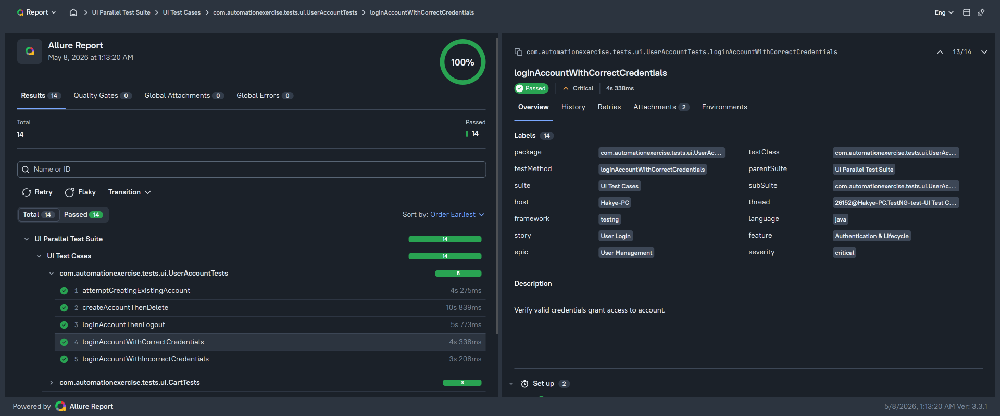
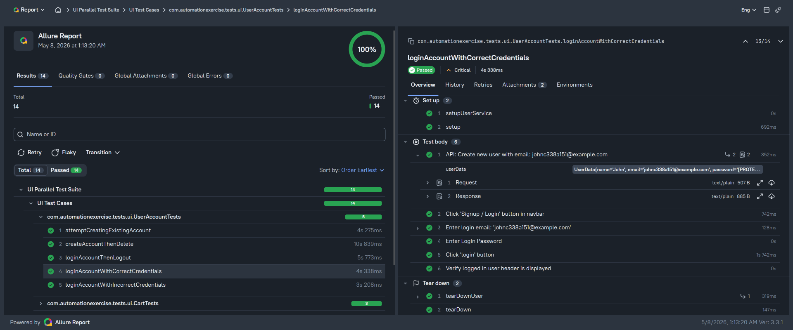
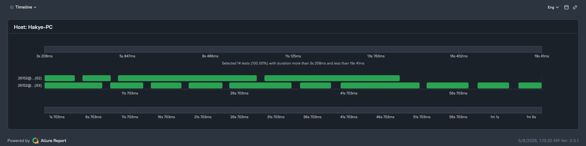
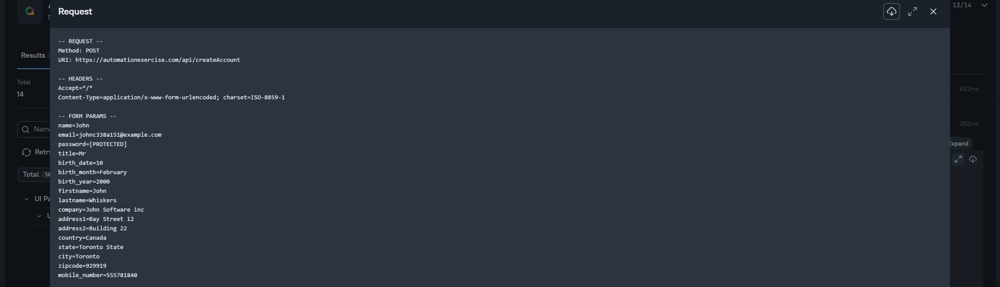
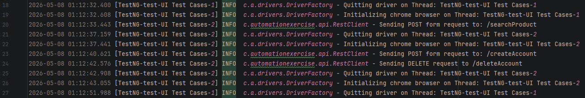

# Automation Exercise Testing
This project is test automation framework targeting [Automation Exercise](https://automationexercise.com/) e-commerce platform.
This repository contains test cases based on automated tests list provided on website.

## Overview
This framework includes end-to-end, feature and api tests with allure reporting and parallel execution. It features:
* **External Configuration:** Environment and URLs are managed through `config.properies` file.
* **Hybrid Testing:** Uses API calls to set up or tear down test data for certain scenarios.
* **Parallel Execution:** Designed with ThreadLocal to run multiple tests simultaneously.
* **Logging:** SLF4J with Logback for thread-safe logging in case of parallel execution.
* **Allure Filter:** Utilizes custom allure filter for API requests and responses attachments.
* **Chromium Browser Support:** Compatible with Google Chrome and Microsoft Edge.

## Tech Stack
This project utilizes the following:
* Java
* TestNG
* Selenium
* RestAssured
* Allure Report
* SLF4J and Logback


## Test Execution
**Configuration:**
Before running tests, configure the requirements in `src/test/resources/config.properties`:
```properties
# Browser Settings
browser=chrome
headless=false

# Wait Timeouts
timeout.seconds=10
```
**Execution Commands:**

To run every test (API and UI together) execute:
```bash
mvn clean test
```
To run only API tests:
```bash
mvn clean test -P api-tests
```
To run only UI tests:
```bash
mvn clean test -P ui-tests
```
To run UI tests in parallel:
```bash
mvn clean test -P ui-parallel-tests
```

## Test Reporting
This project uses Allure Report for generating reports after running tests. Reports include API request and response attachments
and screenshot in case of failure during UI testing.

To see the report run:
```bash
allure serve target/allure-results
```
This will open HTML report in your default browser, where you can explore the test results.
The following showcase is generated by running `suite-ui-parallel.xml` file:



Every test includes steps capturing interactions:



The report includes parallel execution timeline:




## Technical Implementation Notes

### **Custom Allure API Filter**
The standard Allure Filter exposes sensitive fields inside the report attachments. This project
uses a custom `MaskingAllureFilter` for masking such fields and builds cleaner API Request or Response attachments.
This project only masks password field:



### **Thread-Safe Logging**
To show the threads execution timeline clearly during parallel execution, the framework utilizes logback.



### **Constant-Driven Page Objects**
To prevent tests from becoming brittle, all UI text (headers, success messages, error alerts) are stored as `public static final` constants within Page Object classes.
* **Benefit:** If the website developers change a message from *"Account Deleted!"* to *"User Removed!"*, we only update one constant instead of searching through dozens of tests.
* **Example:** `Assert.assertEquals(errorMessage, LoginPage.EMAIL_IN_USE);`

### **Google Vignette Ad Handling**
The Automation Exercise website frequently displays full-screen Google Vignette ads during navigation.
To prevent flaky tests, `BasePage` method gets destination from button and redirects to it if vignette is present.